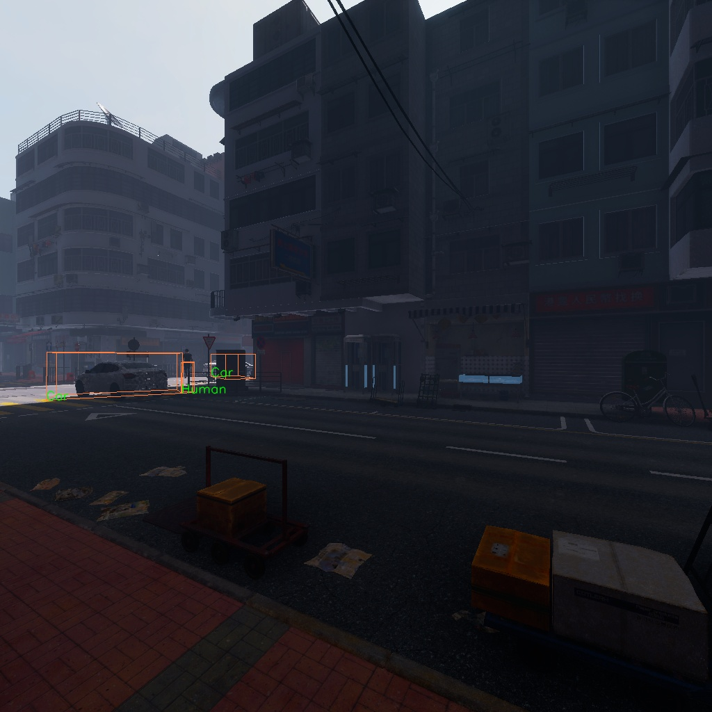

# FreeAskWorld

`FreeAskWorld.py` provides the API for the **FreeAskWorld Dataset**, offering nuScenes-like data processing utilities for research on E2E robot navigation.

---

## Dataset Download
https://huggingface.co/datasets/Astronaut-PENG/FreeAskWorld

## 🚀 Features
- nuScenes-style dataset API  

---

## ⚠️ Important Notes
- The **3D box translation and rotation** are defined with respect to a **specific camera coordinate system**.  
- The **camera extrinsic parameters** are **not real**:  
  - Rotation is set from the camera object (fake)  
  - Translation is correct  
  - These parameters are only intended for conversion between `cam <-> ego <-> world` coordinates.  

---

## 🔍 Visualization
Example of **3D box alignment visualization**:  



---

## 📂 Dataset Structure (recommended)

The dataset is organized hierarchically by **epochs** and **scenes**.  
Each **scene** contains multiple data components for different tasks.

```bash
Root/
├── Epoch1/
│ ├── Scene1/
│ │ ├── FreeAskWorldData/ # Meta information (dataset index, calibration, etc.)
│ │ ├── Metrics/ # Metrics for VLN evaluation
│ │ ├── PerceptionData/ # Sensor data (images, positions, synthetic annotations)
│ │ ├── VLNData/ # Data for VLN tasks (includes language instructions)
│ ├── Scene2/
│ └── ...
├── Epoch2/
│ ├── Scene1/
│ ├── Scene2/
│ └── ...
└── ...
```


### 📌 Notes
- **Epoch**: one collection batch (real-world or synthetic).  
- **Scene**: a continuous recording/trajectory inside an epoch.  
- **FreeAskWorldData**: metadata such as dataset index and calibration.  
- **Metrics**: evaluation metrics for Vision-and-Language Navigation (VLN).  
- **PerceptionData**: raw and synthetic perception data (e.g., camera images, positions, 3D annotations).  
- **VLNData**: multimodal data for VLN tasks, including paired language instructions.  
